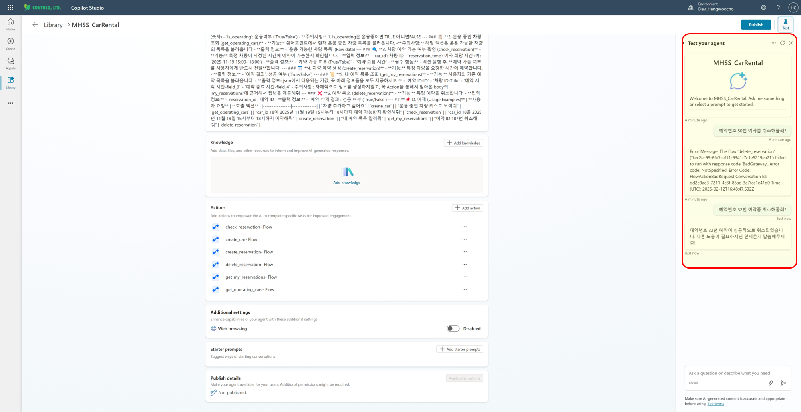

# 🛻 A. 이전 학습 내용  
지난 시간에는 `check_reservation`과 `create_reservation`을 구현하며 **Power Automate**에서 복잡한 로직을 설계하고 구현하는 법을 배웠어요!  
`Apply to Each`, `Condition`, `Initialize value` 등 다양한 **Power Automate** 요소들을 사용했었는데, 다 기억나시나요?  
혹시 기억이 안 난다면 꼭 다시 복습해주세요!  

---

 
 

# 👾 B. 이번 시간 학습 내용  
예약을 만들었으면 **취소**도 할 수 있어야겠죠?  
이번 시간에는 `delete_reservation`을 만들어 **SharePoint 리스트에서 아이템을 삭제하는 방법**을 배워볼 거예요.  
이전 시간보다 난이도는 훨씬 쉽습니다! 😆  
그리고 추가로 **깜짝 Challenge**도 준비되어 있으니 기대해주세요! 🎯  

---

 
 

# ⚒️ C. delete_reservation  
## ✅ delete_reservation이란?  
`delete_reservation`은 **SharePoint의 `reserved_list`에서 특정 예약을 취소하는 액션**입니다.  
사용자로부터 **예약 ID**를 입력받아 해당 아이템을 삭제하는 방식으로 동작해요.  

## 🔎 예약 ID란?  
아이템을 삭제하려면 **ID**가 필요합니다! 그런데…  
"우리가 `reserved_list`에서 ID 컬럼을 만든 적이 있던가?" 🤔  
바로 이 부분이 핵심이에요. `reserved_list`에는 아래처럼 **user_id, reserved_car, reserved_start, reserved_end**만 있는데, **ID는 어디서 찾을 수 있을까요?**  

### 🔍 SharePoint List의 숨겨진 칼럼들  
**SharePoint 리스트에는 기본적으로 숨겨진 칼럼들이 존재합니다.**  
그중 하나가 바로 **ID**예요!  

이렇게 우리가 직접 만들지 않아도 ID가 자동 생성되죠.  
다른 기본 칼럼들도 존재하며, **Add Column → Show & Hide Column**에서 확인할 수 있어요.  

ID를 활용하기 위해 체크박스를 선택하고 Apply를 클릭해 **활성화**시켜줍시다!  

💡 **중요한 점!**  
Power Automate의 `Delete Item` 액션은 **ID 값을 필수 파라미터로 요구**합니다.  
즉, **ID 없이는 삭제 불가**!  
자, 이제 본격적으로 `Flow`를 만들어봅시다. 🚀  

---

 
 

# 🤖 D. 사전 작업  
매번 강조하지만, **Power Automate Flow**를 먼저 만들어야 합니다!  
**Custom Engine 에이전트**에서 Power Automate Flow를 만들어주세요.  
(기억이 안 나신다면 `create_car`를 참고하세요!)  

Flow를 만들었다고 가정하고, 이제 설명을 이어가겠습니다.  

---

 
 

# 🚀 E. Run flow from Copilot  
이번 Flow에서는 사용자로부터 **단 하나의 인풋**만 받습니다.  
바로 **삭제할 예약의 ID**죠!  
아래와 같이 설정해주세요.  

  

| 변수명 | 타입 | 설명 |
|--------|------|------------------------------|
| `reservation_ID` | Number | Please enter the reservation_ID |

---

 
 

# 🗑️ Delete Item  
1. **SharePoint 사이트와 `reserved_list`를 연결**  
2. **ID에 `reservation_ID` 값을 넣어주기**  
3. **Run flow from Copilot에서 받은 `reservation_ID`를 다이나믹 컨텐츠로 설정**  

(이 부분은 많이 다뤘으니 추가 설명 생략! 기억이 안 나면 앞 내용을 참고하세요 😉)  

---

 
 

# 🎉 F. Respond to Copilot  
삭제 후 **성공 여부만 응답하면 됩니다!**  
아래처럼 설정해 성공적으로 삭제되었음을 알려주세요.  

🎉 이렇게 하면 `delete_reservation` Flow 완성!  
지난 시간보다 훨씬 쉽죠? 😆  

---

 
 

# 🚆 G. Declarative Agent로 옮기기  
## 🔄 사후 작업  
**이제 Flow를 Declarative Agent로 옮겨야겠죠?**  
이 과정도 **입이 아플 정도로** 반복한 내용입니다. 😅  
아래 순서대로 진행해주세요!  

📌 **옮기는 방법**  
1. **Power Automate에서 Flow 이름을 `delete_reservation`으로 변경**  
2. **Flow를 저장(`Save`)하고 배포(`Publish`)**  
3. **Custom Engine Agent에서 Power Automate Flow를 불러오고 액션 추가**  
   - **불러오는 데 시간이 걸릴 수 있으므로 새로고침 진행**  
4. **Custom Engine Agent의 코드 에디터에서 해당 코드 복사**  
5. **Declarative Agent에서 Dummy 액션을 만들고, 복사한 코드를 붙여넣어 덮어쓰기**  
6. **Declarative Agent Overview에서 액션 이름을 `delete_reservation`으로 변경**  

🎯 완료 후, 아래처럼 `delete_reservation`이 등록되면 성공입니다!  

---

 
 

# 🛸 H. delete_reservation 테스트  
테스트를 진행하기 전에 **중요한 문제**가 있습니다!  
바로…  
"내가 예약한 내역을 확인할 수 있는 기능이 없어요!" 😱  

예약을 취소하려면 **예약 ID**를 알아야 합니다.  
즉, **get_my_reservation** 기능이 필요합니다.  
그래서 이번 테스트에서는 **Challenge**를 드릴게요! 🎯  

테스트를 위해서는  
1. `create_reservation`을 실행해 예약을 생성  
2. `reserved_list`에서 직접 ID 확인 후 삭제  
3. 삭제 결과 확인  

위처럼 예약이 잘 취소되면 성공입니다! 🎉  
맨 처음에 에러가 뜬이유는 ID 50번이 데이터베이스에 없어서에요. 제가 이미 지웠더라고요 하하하  

---

 
 

# 🛹 I. Challenge: get_my_reservation  
## 🏆 미션: get_my_reservation 구현하기  
`reserved_list`에서 **내가 예약한 목록만 필터링**해서 보여주는 기능을 만들어야 합니다!  

💡 이미 우리가 배운 내용을 활용하면 충분히 구현할 수 있어요!  

## ✅ Desired Output  
아래처럼 **"내 예약 목록을 보여줘"**라고 요청하면,  
해당 사용자의 예약 내역이 출력되어야 합니다.  

## 🔎 Hint  
1. **어떤 액션을 활용해야 할까요?**  
   - 당연히 **`Get Item`**을 써야겠죠?  
2. **필터링 기준은 무엇일까요?**  
   - 특정 유저의 예약만 가져와야 합니다!  
3. **필터링할 값을 어떻게 Flow에 전달할까요?**  

이 **세 가지 질문에 대한 답**을 찾으면 충분히 구현할 수 있어요! 💪🔥  

---

 
 

# ✅ J. 마치며  
👏 **축하합니다!**  
여러분은 **회사 차량 예약 시스템을 운영하는 AI 에이전트를 성공적으로 구현**하셨습니다!  

이제 SharePoint List에서 **읽기, 쓰기, 삭제, 업데이트**까지 모두 다룰 수 있어요.  
이러한 기능을 **CRUD**라고 부르며,  
**회사 차량 예약 시스템뿐만 아니라 거의 모든 서비스에 필수적으로 사용됩니다!** 🚀  
여기서 멈추는게 아니라 Copilot Studio의 다양한 기능을 확인하고 
확장성 높게 에이전트를 만드는 것을 즐겨보세요. 

📌 아래의 **완성본을 확인하고, 다양한 테스트를 진행해보세요!**  

  

다음 프로젝트에서 다시 만나요! 😆  
**수고 많으셨습니다!** 🎊

