# 📌 A. 이전 학습 내용  
이전 시간에는 `get_operating_car`를 구현하면서 다음 내용을 배웠어요.  

✅ SharePoint List의 아이템을 가져오는 방법을 배웠어요!
✅ Filter Query를 사용하여 아이템을 필터링하는 방법을 배웠어요!
✅ List의 칼럼의 시스템명을 찾는 방법을 배웠습니다 

3번은 이번강의에서도 쓰이기에 특히 중요해요:)

---

 
 

# 🚆B. 이번 학습 내용  
이번 학습은 약간 어렵습니다!  
이번에는 **예약 가능 여부를 확인하는** `check_reservation`과 **예약을 생성하는** `create_reservation`을 구현하면서 **Power Automate로 복잡한 로직을 설계**해볼 거예요.  
이번 강의를 마스터하면 **필요한 모든 로직을 Power Automate로 구현**할 수 있을 거예요!  
🚀 그러니 힘내서 달려 보자고요!

---

 
 

# 🎉 C. 사전 작업  
- `create_car`, `get_operating_cars`와 마찬가지로 **Custom Engine 에이전트에 Power Automate Flow를 구현한 후 Declarative Agent로 옮기는 작업**을 진행해야 해요!  
  벌써 세 번째라 능숙하게 진행하실 거라 믿어요.  

- 플로우 덮어쓰기를 위해 Custom Engine 에이전트에서 새로운 Power Automate Flow를 만들어주세요.  
- **Custom Engine 에이전트 → Action → Power Automate Flow 생성**해주시면 됩니다.   
- **기억이 잘 안 나시는 분들은 `create_car`를 참고**해 주세요!  

그럼 여러분이 Custom Engine Agent에서 Power Automate Flow를 잘 생성했다고 믿고 아래 화면에서 설명을 시작할게요.  

---

 
 

# 🚀 D. check_reservation  
## D-1). check_reservation이란?  
`check_reservation`은 **`car_id`, 예약 시작 시간, 종료 시간을 입력받아 해당 시간에 예약이 가능한지 확인하는 로직**이에요.  
유저 입장에서 보면 `create_reservation`을 실행하기 전에 예약 가능 여부를 확인해야 하기 때문에 `check_reservation`은 필수 기능입니다!  

## D-2) 🗺️ Overview  
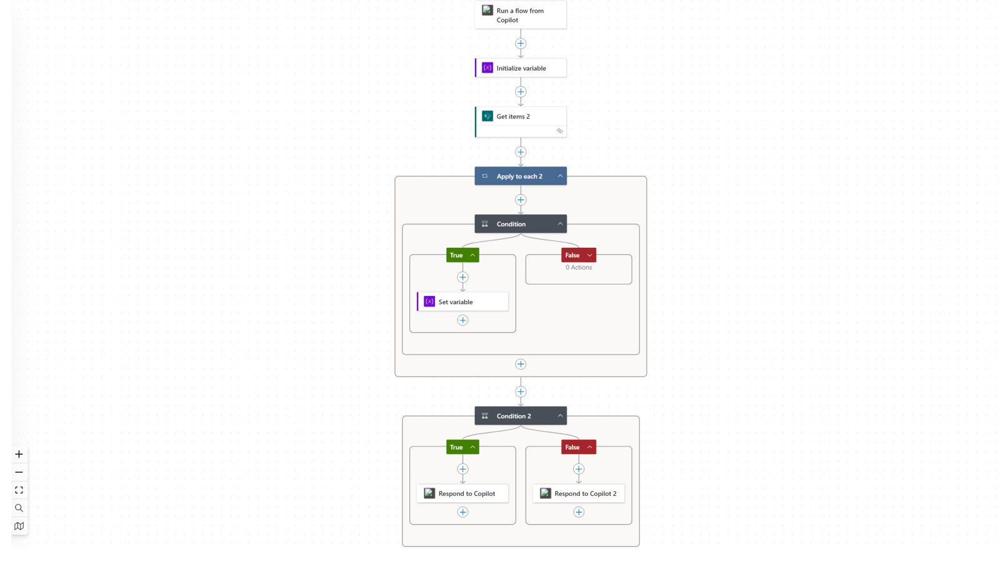
전체적인 로직은 위와 같아요. 생각보다 복잡해 보이지만, 차근차근 따라오면 쉬우니 가보자고요!  

간단히 설명하면,  
1. `Run a flow from Copilot`에서 `car_id`, `예약 시작 시간`, `종료 시간`을 전달받음  
2.`Initialize variable`을 사용해 해당 시간에 예약이 이미 있는지 기록  
3. `Get Items`로 해당 차량의 기존 예약 내역을 가져옴  
4. `Apply to Each`를 돌면서 중복 예약을 검증  
5. `Condition`에서 중복 예약이 있으면 예약 불가 메시지 반환  

하하 이제 하나씩 하나씩 진행해볼게요! 🚀  

---

## D-3) 🔄 Run a flow from Copilot  
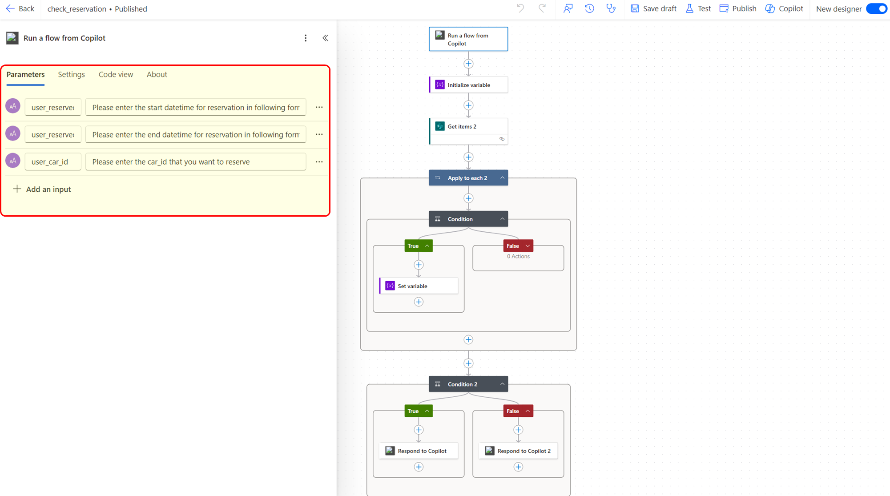

- `Run a flow from Copilot`은 **Power Automate Flow를 위해 Copilot이 유저에게 받아야 하는 정보를 지정하는 단계**예요.  
- 예약 가능 여부를 확인하려면 **다음 정보를 입력받아야 해요.**  

| 변수명               | 타입  | 설명 |
|-------------------|------|------------------------------------------------------------|
| `user_reserved_start` | Text | 예약 시작 시간을 **`yyyy-MM-ddTHH:mm:ss`** 형식으로 입력해주세요. |
| `user_reserved_end`   | Text | 예약 종료 시간을 **`yyyy-MM-ddTHH:mm:ss`** 형식으로 입력해주세요. |
| `user_car_id`        | Text | 예약하려는 차량의 `car_id`를 입력해주세요. |

- **위 정보를 Parameter에 입력해주세요.**  
- **Description을 상세하게 작성해야 Copilot이 유저 입력에서 필요한 파라미터를 잘 추출할 수 있어요.**  

### ❓질문:  왜 `yyyy-MM-ddTHH:mm:ss` 형식을 사용할까요?  
이 형식은 **ISO 8601 표준 형식의 변형**이에요.  
쉽게 말하면, **전 세계적으로 시간을 일정한 형식으로 저장하자고 약속한 것**이에요!  

이 형식을 사용하면 **날짜 및 시간을 일정한 형식으로 유지하여 이후 시간 비교나 정렬이 용이해요.**  
물론 SharePoint List에서 **Date/Time으로 저장하면 더 좋겠지만**, 1강에서 설명드렸듯이 **서버 위치에 따라 시간대가 잘못 저장되는 이슈**가 있어요.  
따라서 **우리는 텍스트 형식으로 시간을 저장하고 관리**할 거예요.  

---

## D-4) 🔧 Initialize variable  
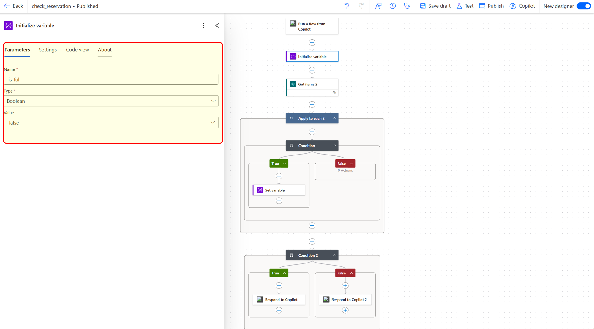

- `Initialize variable`은 **변수를 생성하는 기능**이에요.  
- 이번에 만들 변수는 `is_full`로, 타입은 `Boolean`이에요.  
- 설정값은 아래와 같아요.  

| 이름      | 타입    | 초기값  |
|----------|--------|-------|
| `is_full` | Boolean | `false` |

### 🔍 변수를 생성하는 이유  
변수를 생성하는 건 **정보를 저장할 수 있는 이름표를 만드는 것**과 같아요.  
예를 들어, "내 나이 = 25" 라고 정하면 **나이를 25로 기억하고 나중에 사용할 수 있는 것**처럼,  
우리는 **예약이 이미 차 있는지를 확인하기 위해 `is_full` 변수를 선언**하는 거예요.  

초기값을 `false`로 설정했으니, **기본적으로 예약이 차 있지 않은 상태**로 시작하는 거죠.  

---

## D-5). 📥 Get Items  
- 이제 유저에게 전달받은 `car_id`를 사용해서 **해당 차량의 기존 예약 정보를 가져와야 해요.**  
- `Get Items`를 사용해서 해당 차량의 예약 내역을 불러오고, 원하는 예약 시간과 비교하는 방식이에요.  
- `get_operating_car`에서 했던 방식과 동일하게 설정하면 됩니다.  

### Get Items에서 설정칸들을 아래와 같이 설정해주시면 됩니다!  
| 요소명          | 입력할 값 |
|--------------|-----------------------------|
| `Site Address` | SharePoint Page 주소 입력 |
| `List Name`   | `reserved_list` (예약 목록이 저장된 리스트) |
| `Filter Query` | `{Column car_id의 시스템명} eq 'user_car_id'` |

- **`get_operating_car`에서 했던 것처럼 Advanced parameters 드롭다운을 클릭하고 `Filter Query`를 선택해야 입력할 수 있어요.**  
- 아래 화면을 참고해서 진행해주세요.  
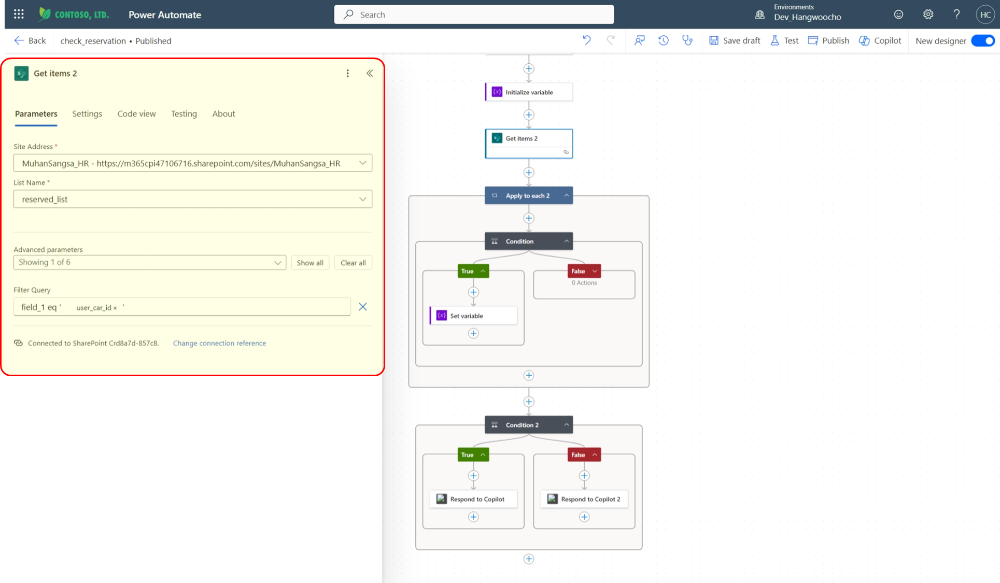

### ⚠️ Filter Query 주의사항  
- `car_id`의 **시스템명**을 정확하게 입력해야 해요.  
- **`Filter Array`를 사용해서 `car_id`의 시스템명을 찾아주세요.** (`filed_1`이 아닐 수도 있어요!)  
- **기억이 안 나면 `get_operating_car` 내용을 다시 참고하시면 Filter Array를 참고해서 칼럼의 시스템 명을 찾는법이 자세히 나와있습니다**  
- **`user_car_id`는 다이나믹 컨텐츠에서 `Run a flow from Copilot`의 파라미터로 가져와야 해요.**  
- **주의! `user_car_id`는 텍스트로 취급되므로 `'`를 앞뒤로 붙여줘야 합니다.** 저도 3시간 헤맸으니 여러분은 헤매지 마세요.   

## D-6) 🔄 Apply to Each  
### Apply to Each에 대해  
**Apply to Each**는 Power Automate에서 **배열 데이터를 하나씩 처리하는 반복문 기능**이에요.  
우리는 `Get Items`를 사용하여 특정 `car_id`의 예약 목록을 가져왔기 때문에, **각 예약을 순회하면서 예약 시간이 겹치는지 검사**해야 해요.  

### Apply to Each 설정법  
- 1. **`Get Items` 밑의 `+` 버튼을 클릭하고 `Apply to Each` 추가**해주세요!  
- 2. **Apply to Each의 Parameter 설정**를 설정해주세요  
  - `body/value`를 다이나믹 컨텐츠에서 선택해서 넣어주자!  
  - 방법: `/` 버튼을 눌러 `Dynamic Content`에서 `Get Items`의 `body/value` 선택  
  - `body/value`는 `Get Items`에서 불러온 예약 목록 배열을 의미합니다. 
  - 아래를 참고해주세요~
  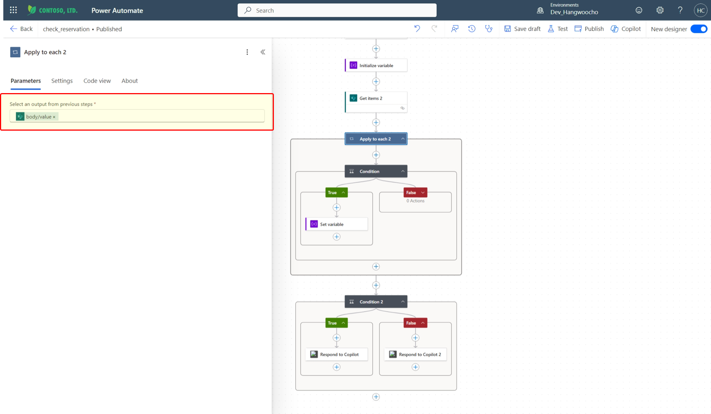
 

### Apply to Each 안에 모듈을 넣는다는 의미  
- **Apply to Each 내부에 `Condition`을 추가하면 `body/value`의 모든 항목을 검사하는 구조가 됩니다**  
- 즉, **각 예약 데이터를 `Condition`을 통해 비교**하여 예약 시간이 겹치는지 확인할 수 있는거죠  

---

## D-7)⚠️ **주의: 지금부터 Old UI로 변경해주세요!**  
  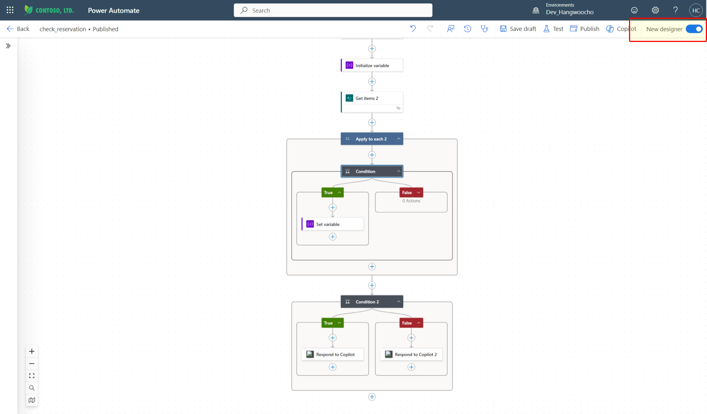
### **Old UI로 전환하는 이유**  
- **New Designer에서는 복잡한 Condition 설정이 지원되지 않음**  
- **Old UI에서 `body/value`가 `value`로 표시될 수 있으니 혼동 금지**  
- 저는 이 사실을 몰라 작업 내용을 여러 번 잃었음... 눈물 😭  
- 아래처럼 Old UI로 전환되면 성공!
  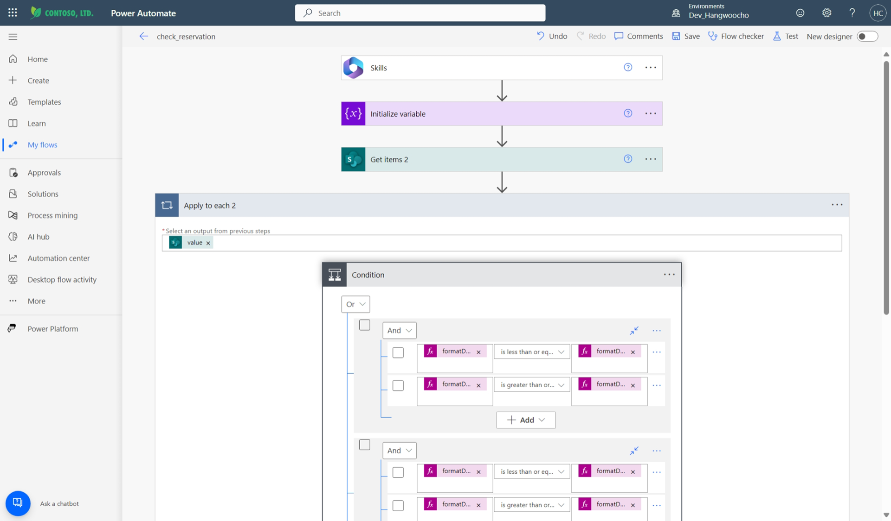

---

## D-8) ✅ Condition 1  
### Condition이란?  
**Condition**은 특정 조건을 검사하고,  
- **조건이 참(True)이면 특정 경로**로 진행  
- **조건이 거짓(False)이면 다른 경로**로 진행하는 **If 문과 유사한 기능**이에요.  

예를 들어,  
- 이메일 제목이 `"긴급"`이면 알림을 보내고, 그렇지 않으면 무시하는 자동화 기능을 Condition을 사용해서 쉽게 구현할 수 있죠. 
여기서는 고객이 예약을 원하는 시간에 이미 예약이 차있는지 아닌지를 검증하기에 이 기능을 사용합니다. 

### 특정 예약 시간대가 이미 찬 경우를 확인하려면 어떻게 해야할까요?
신규 예약과 기존 예약이 **겹치는지 확인**해야 해요. 
인간이라면 딱 직관적으로 예약이 겹치는지 안겹치는지 알 수 있겠지만, 
로직으로 설계한다면 어떻게 설계하면 고객이 예약을 원하는 시간이 예약이 차있는지 아닌지 알 수 있을까요?  

#### 예약이 겹친다고 판단할 수 있는 두 가지 주요 조건  
1. **신규 예약 시작 시간이 기존 예약 범위(시작 ~ 종료) 내에 포함될 때**  
   - 기존 예약: **10:00~11:00**  
   - 신규 예약: **10:30~11:30** → `10:30`(신규 시작 시간)이 기존 예약 범위 안에 있음 → **겹침 발생**  
2. **신규 예약 종료 시간이 기존 예약 범위(시작 ~ 종료) 내에 포함될 때**  
   - 기존 예약: **10:00~11:00**  
   - 신규 예약: **9:30~10:30** → `10:30`(신규 종료 시간)이 기존 예약 범위 안에 있음 → **겹침 발생**  

💡 **이 두 조건을 만족하면 신규 예약과 기존 예약이 겹친다고 판단**할 수 있습니다!  
👉 저는 위 방법을 사용했지만 **위 방법 외에도 여러 가지 숨겨진 조건식이 있을 수 있어요. 한 번 고민해보면 재밌을 것 같아요!**  

---

### 위 로직을 Condition에 설정하기 
자 이제 어떤 로직을 설정하면, 예약이 겹치는것을 판별할 수 있는지 알게 되었으니, 이제 이걸 Condition에 구현해 볼까요? 
저희의 목표는 아래와 같은 로직을 구현하는 거에요. 
  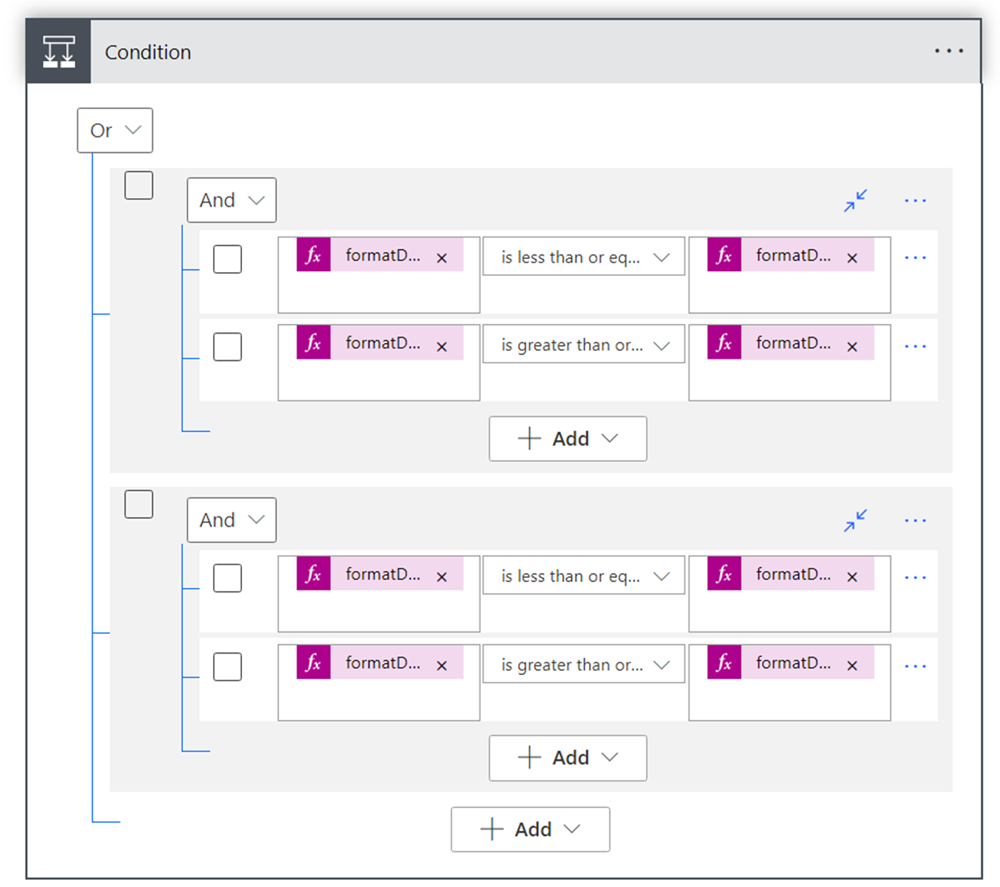

- 빈칸에서 부터 차분차분히 구현해봅시다. 

1. **Apply to Each 내부에 `Condition` 추가**  
2. **`Add Group`을 클릭하여 Group을 2개 추가**  
3. **기본적으로 존재하는 `row`를 삭제**  
위 사항을 진행하면 아래 상태가 됩니다!
  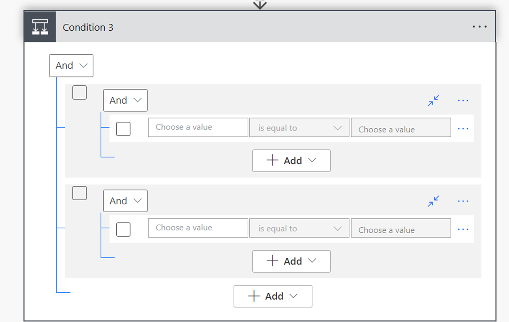  

---

### **Condition 그룹별 설정**  
각 그룹에 `Add Row`를 추가하면 결국 아래와 같은 포맷이 되는데요 
  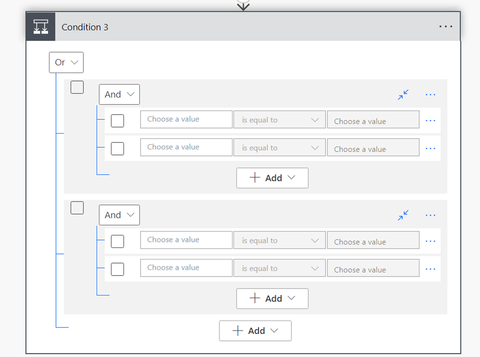

  
- **상위 조건은 OR, 그룹 내 조건은 AND**로 수정해주시고 아래 내용을 다이나믹 expression을 사용해서 채워넣어 줄겁니다. 

Group1.
| Expression 1 | 조건 | Expression 2 |
|-------------|------|-------------|
| `formatDateTime(triggerBody()['text'],'o')` | `is less than or equal` | `formatDateTime(item()?['field_4'],'o')` |
| `formatDateTime(triggerBody()['text'],'o')` | `is greater than or equal` | `formatDateTime(item()?['field_3'],'o')` |

Group2.
| Expression 1 | 조건 | Expression 2 |
|-------------|------|-------------|
| `formatDateTime(triggerBody()['text_1'],'o')` | `is less than or equal` | `formatDateTime(item()?['field_4'],'o')` |
| `formatDateTime(triggerBody()['text_1'],'o')` | `is greater than or equal` | `formatDateTime(item()?['field_3'],'o')` |

⚠️ 하지만 아직 채우지 말아주세요!  
⚠️Expression 식들이 사람마다 다 다를거기떄문에 아래 설명을 듣고 자기에게 맞는 식을 채워넣어주세요.
위의 포맷은 유지되지만, 안의 컨텐츠는 바뀔 수 있어요. 

### **Condition에서 Expression 작성하기**  
우선 Expression을 어떻게 작성하는지 작성법을 알려드리겠습니다!
  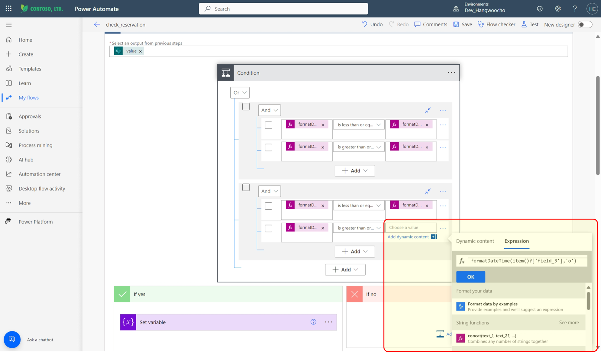
#### **Expression 작성법**  
1. 위를 보면 **Old UI에서 `박스`를 선택하면 하단에 `Add Dynamic Content` 버튼이 나타남**  
2. **`Add Dynamic Content` 클릭 → `Expression` 탭으로 이동**  
3. **Expression을 입력**  

#### **Expression 1 설명**  
- `formatDateTime(A,B)` → **A 값을 B 시간포맷으로 변환**하겠다는 의미입니다.   
- **우리는 `o`(ISO 8601 표준) 포맷을 사용**  
- `triggerBody()['text']` → **Copilot에서 받은 `user_reserved_start`**  
- `triggerBody()['text_1']` → **Copilot에서 받은 `user_reserved_end`**  
- 결국 text는 reserved_start을 나타내고, text_1은 user_reserved_end를 나타내는 것이지요.

❗ **주의사항**
- 이제 Expression 1식을 채워넣어주시는데 아래사항을 유념해서 채워넣어주세요!  
- **Dynamic Content에서 `user_reserved_start`와 `user_reserved_end`를 선택한 후, 이를 주소창에 복사 붙여넣기하여 시스템명을 꼭 확인해주세요**  
- `triggerBody()['N']`의 `N` 부분에 **올바른 시스템명을 입력해야 합니다**  
- **Expression을 입력한 후 값이 반영되었는지 체크해주세요!**  
  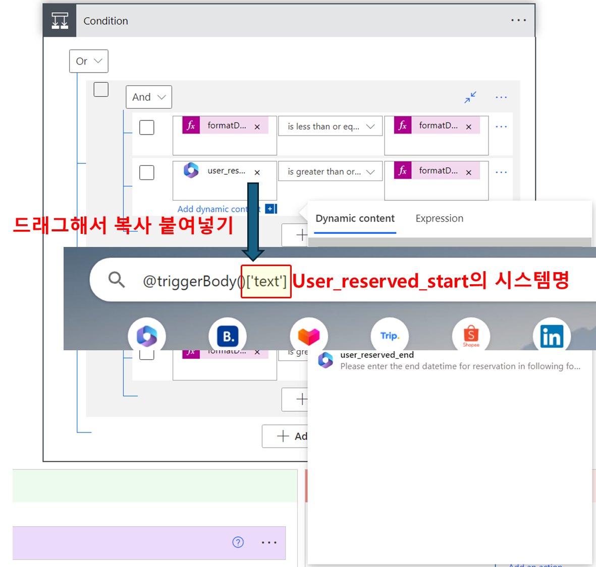

---

#### **Expression 2 설명**  
- `item()?['field_4']` → 예약 목록에서 가져온 `reserved_start`을 나타내요.
- `item()?['field_3']` → 예약 목록에서 가져온 `reserved_end`을 나타내요.  
- **이 값을 사용하여 예약 시간 충돌 여부를 확인**을 확인할거에요!  
- **컬럼 시스템명 확인은 `Filter Array`를 통해 가능**하다는거 기억나시죠....?  
- **Filter Array를 만들었을 때, Apply to Each가 자동으로 추가되더라도 삭제해도 무방**합니다!  
- 중요한 것은 `reserved_start`와 `reserved_end`의 **시스템명을 올바르게 추출하는 것**이에요. 
  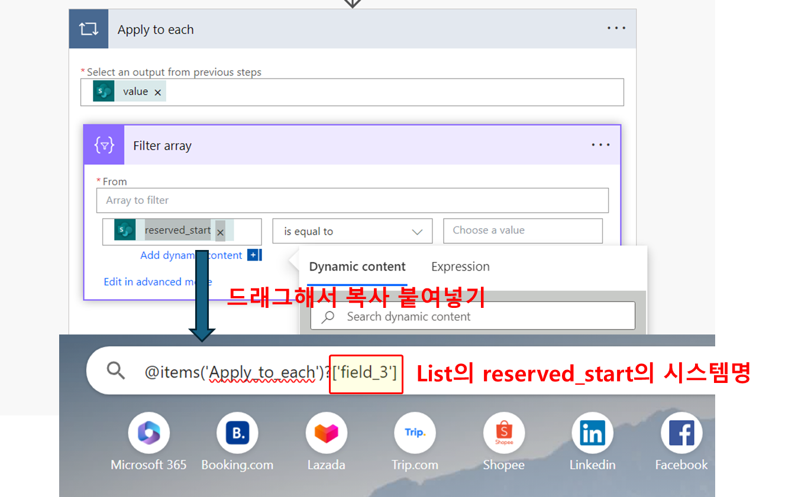

### ✅ 결과 별로 행동을 정의하자  
- 이제 condition을 통해, 각 예약 객체들중에 겹치는게 있는지 없는지 걸러낼 수 있게 되었어요!
- 그렇다면 이제 예약들 중에 겹치는 것과 안겹치는 것에 행동을 다르게 정의해줘야겠죠? 

#### 🔹 조건식이 참인 경우 (If Yes)  
- 유저가 원하는 예약 시간대에 이미 예약이 존재한다는 뜻!  
- 따라서 **`is_full` 값을 `true`로 변경**해야 해요.  
- **If Yes 내부에 `Set Variable` 추가 → `is_full` 값을 `true`로 설정**해주세요.   

#### 🔹 조건식이 거짓인 경우 (If No)  
- 예약이 겹치지 않으므로 `is_full` 값을 변경할 필요 없겠죠.  
- 추가 액션 없이 그대로 진행해주세요.  

아래 처럼 구현되면 성공입니다!
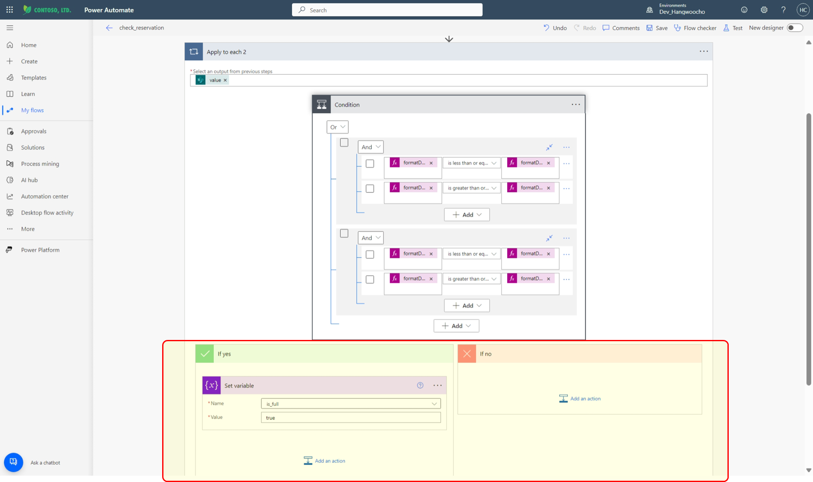

👉 **여기까지 진행하셨다면 정말 대단합니다!** 🎉  
**이 단일 기능을 개발하는 데 3일이 걸렸어요...**  
이제 **마지막 단계**, `Condition 2`를 생성하여 Copilot에게 최종 결과를 반환해 줍시다! 🚀  

---

## D-9) ✅ Condition 2 – Copilot 응답 처리  
### **`is_full` 값을 기반으로 Copilot에 응답 반환**  
- `Condition`을 추가하고 **아래 조건을 설정**  
  | 변수 | 조건문 | 값 |
  |------|------|----|
  | `is_full` | `is equal to` | `true` |

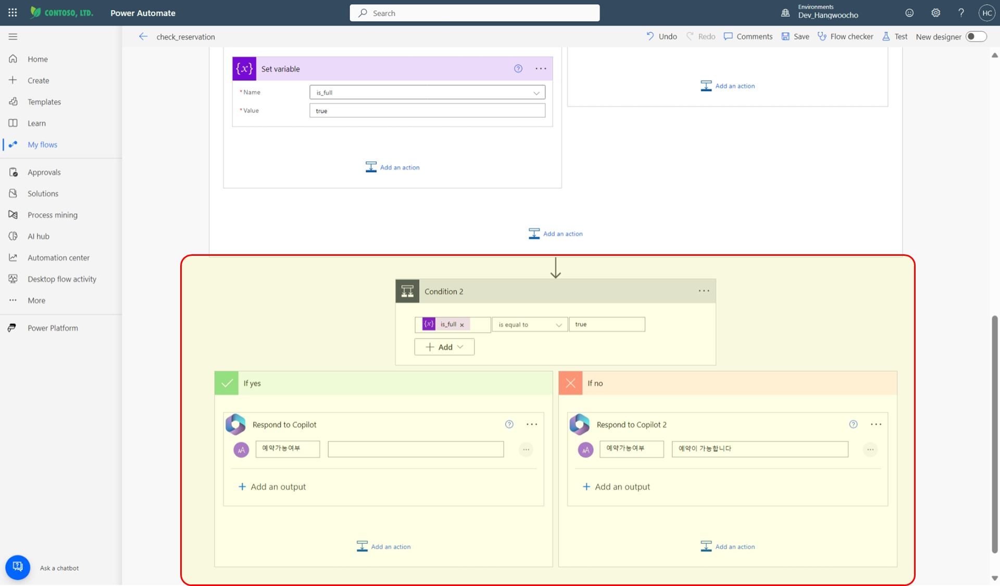 

### ✅ `is_full`이 `true`일 경우 (If Yes)  
- **예약이 이미 존재하는 경우**  
- `Respond to Copilot`을 추가하여 **예약 불가능 메시지 반환**  

### ❌ `is_full`이 `false`일 경우 (If No)  
- **예약 가능**  
- `Respond to Copilot`을 추가하여 **예약 가능 메시지 반환**  

이제 Copilot이 `car_id` 기준으로 원하는 시간에 예약이 가능한지 확인할 수 있어요! 🎉  

 - 여기까지 진행하셨다면, check_reservation의 Flow 완성 입니다! 

- 완성했다면 혹시 모르니 제가 맨처음에 제시한 Overview랑 일치하는지 확인해볼까요? 로직이 복잡하다 보니, 구조가 달라질수도 있거든요. 
- Save를 누르시고 New Designer를 활성화 시켜주신뒤 아래 화면의 로직의 전체적이 구조랑 똑같은지 한번 확인해주세요!  

 Declarative Agent로 Flow를 옮기는 사후작업은  create_reservation 설명드린 뒤 같이 진행해 보시죠. 

---

 
 

# 🤖 F.create_reservation 만들기  
👉 **좋은 소식! `create_reservation`은 `check_reservation`에 단 하나의 액션만 추가하면 끝납니다.**  
👉 **즉, `Condition 2`에서 `No` 경로에 `Create Item`을 추가하면 완성!** 
- 아래는 create_Reservation의 flow에요. 하이라이트된 부분에 Create_item만 추가하고 마이너한 수정만 해주면 된답니다.  
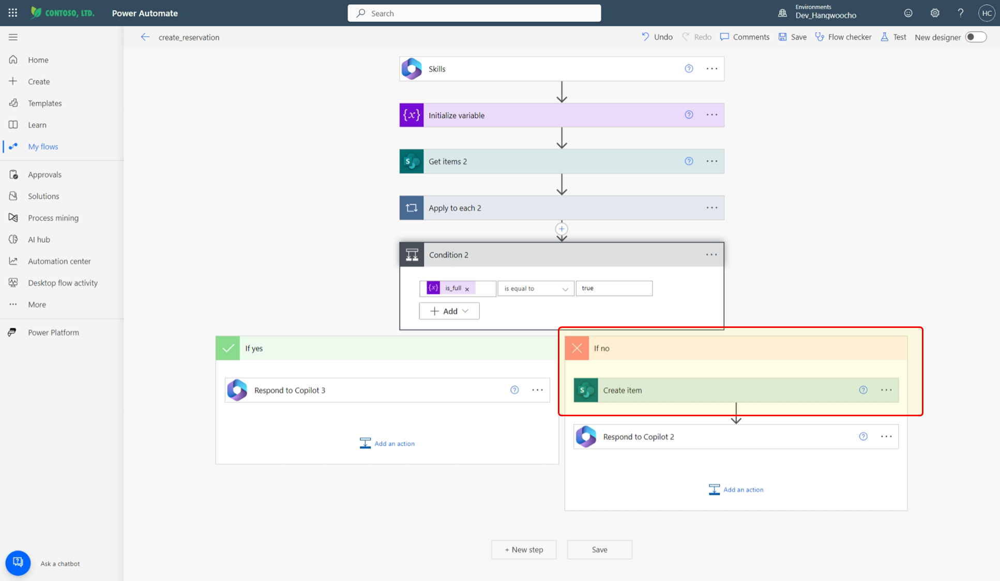

## 📌 create_reservation이란?  
- 유저가 차량을 예약하는 기능입니다!
- 입력값: `reserved_start`, `reserved_end`, `user_id`, `car_id`.  
- `user_id`는 유저가 직접 입력하는 것이 아니라, Copilot이 현재 **로그인된 유저 정보를 자동으로 입력**하도록 구현할거에요. 

---

## 🛠️ 사전 작업 
- create_resrevation은 check_reservation이랑 거의 똑같기에 create_reservation이랑 똑같은 플로우를 하나 만들어주세요!
- `Custom Engine Agent`에서 `Power Automate Flow`를 생성한 후
- `check_reservation`와 똑같이 구현해주세요 

💡 **강력한 기능: 복붙(Copy & Paste)**  
- **Old UI에서는 복사 & 붙여넣기 기능이 가능**하답니다!  
- `3-dot 버튼`을 클릭하여 `복사(Copy)` 한 뒤, 액션을 추가하기 위해  `+ Add an action`을 누르고 `My Clipboard`에서 복사한 모듈 선택할 수 있어요!
- 주의: **New Designer에서는 복붙 기능이 없으므로 Old UI를 사용해야 함**  
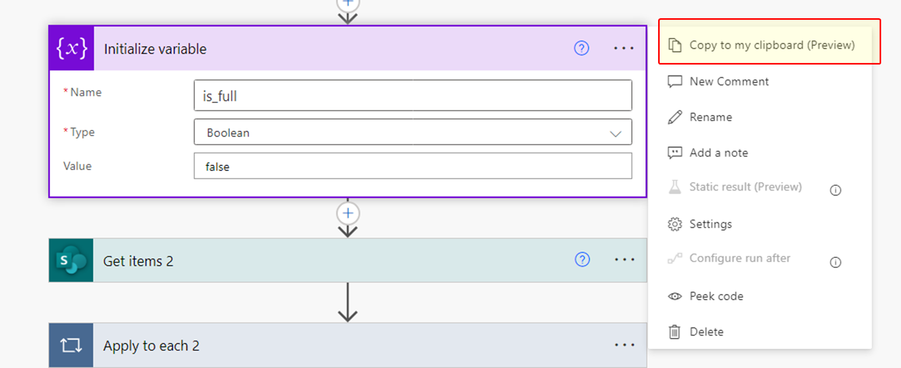  

- 복붙 기능을 사용해 check_reservation과 똑같이 구현하셨나요? 이제는 똑같이 구현하셨다 가정하고, 이 flow를 약간만 수정해서 create_resrevation을 만들어보시죠.

---

## ✅ user_id 추가하기  
- user_id가 파라미터로 추가되었네요. 
- `Respond to Copilot`에 `user_id`를 추가해야 함.  
- 나머지 파라미터는 그대로 두시고 아래 파라미터를 추가해주세요!
  | 파라미터명 | 타입 | 설명 |
  |-----------|------|------------------------------------------------------|
  | `user_id` | `Text` | "Please enter the user_id" |

*그림 내 Description이 잘못되었네요...
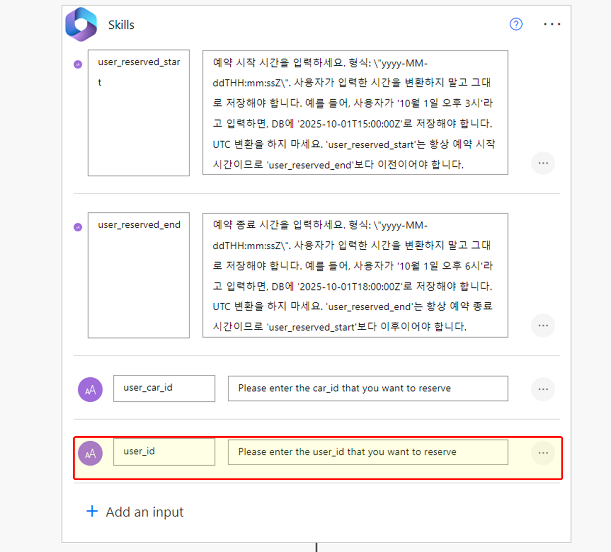

---

## ✅ Create Item 추가하기  
- `Condition 2`의 **If No** 경로에 `Create Item` 추가  
- `Respond to Copilot` 이전에 `Create Item`을 추가해야 함.  
  (만약 위쪽에 `+` 버튼이 보이지 않으면 아래쪽에 추가한 후 드래그하여 위치 조정)  
- **연동할 SharePoint 리스트: `reserved_list`**  
- **다이나믹 컨텐츠를 활용하여 각 필드 설정**  
  | 필드명 | 값 (Dynamic Content) |
  |--------|----------------------|
  | `car_id` | `user_car_id` |
  | `user_id` | `Activity.from.id` |
  | `reserved_start` | `user_reserved_start` |
  | `reserved_end` | `user_reserved_end` |

- **예약 결과를 Copilot에게 전달**하도록 Respond to Copilot 부분도 살짝 수정해주세요!  
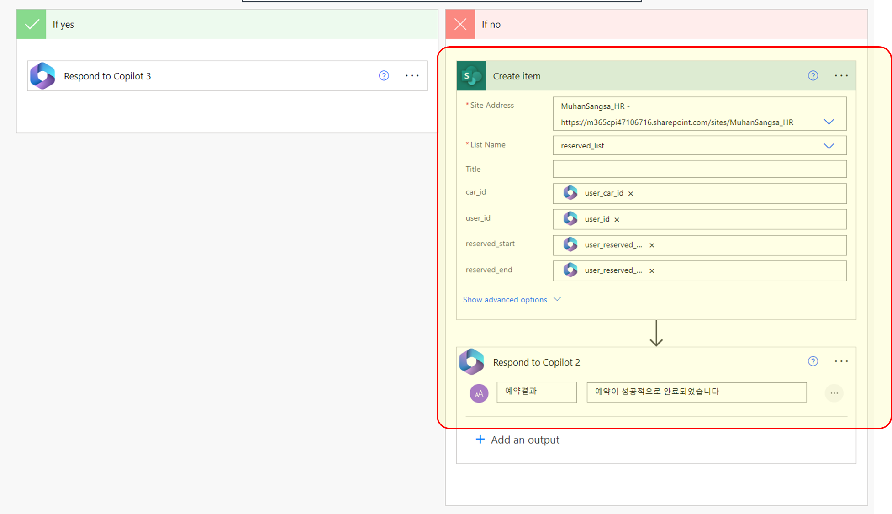 

🎉축하드려요! create_resrvation flow도 완성하셨습니다. 

---

 
 

# ✅ F. Declarative Agent로 옮기기  
## 🚀 사후 작업  
👉 **이제 `check_reservation`과 `create_reservation`을 Declarative Agent로 옮겨야 합니다!**  
👉 **이 과정은 `create_car`에서 이미 설명**했으므로 아래사항 동일하게 진행해주시면 됩니다~  

## 📌 옮기는 방법  
1. **Power Automate에서 Flow 이름을 각각 `check_reservation`, `create_reservation`으로 변경**  
2. **Flow를 저장(`Save`)하고 배포(`Publish`)**  
3. **Custom Engine Agent에서 Power Automate Flow를 불러오고 액션 추가**  
   - **불러오는 데 시간이 걸릴 수 있으므로 새로고침 진행**  
4. **Custom Engine Agent의 코드 에디터에서 해당 코드 복사**  
5. **Declarative Agent에서 Dummy 액션을 만들고, 복사한 코드를 붙여넣어 덮어쓰기**  
6. **Declarative Agent Overview에서 액션 이름을 `check_reservation`, `create_reservation`으로 변경**  

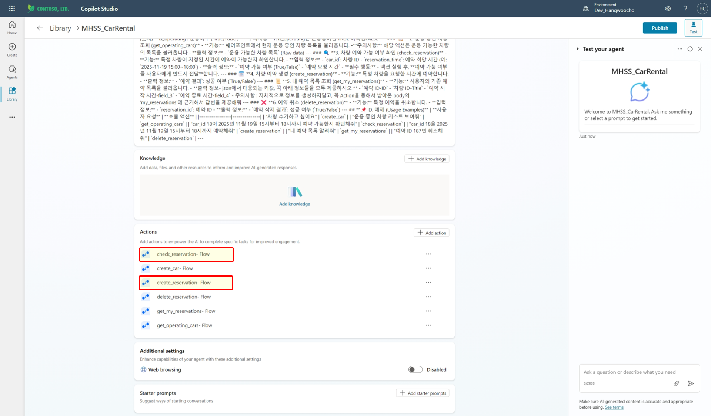  
👉 **이제 Declarative Agent가 `check_reservation`과 `create_reservation`을 사용할 수 있게 되었어요요!** 🎉  

---

# ⚒️ G. create_reservation의 user_id 자동 입력 설정  
👉 create_resrevation에서 `user_id`는 유저가 직접 입력하지 않고, 에이전트가 자동으로 인식해서 **넘겨주게 해야합니다!.**  
👉 이부분은 **Declarative Agent에서 액션에 들어가서 따로 설정이 필요해요**  

## 설정 방법  
1. **Declarative Agent에서 등록한 `create_reservation` 액션 클릭 → Details Page 이동** 해주세요!
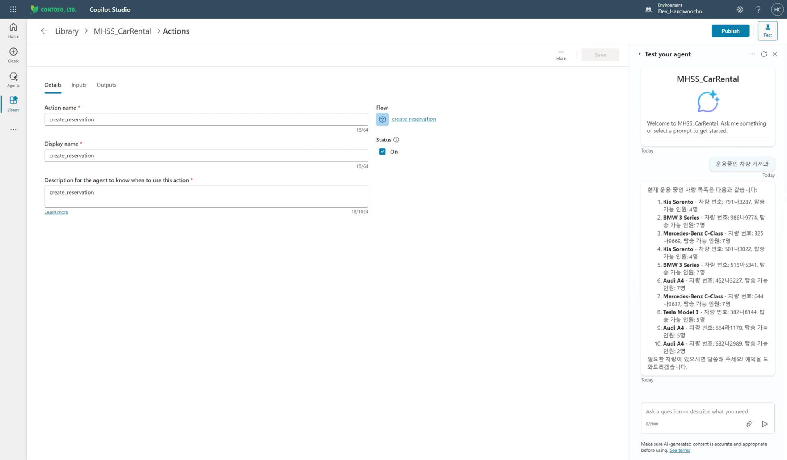

2. **`Input` 탭에서 `User ID` 항목을 찾아주세요**  
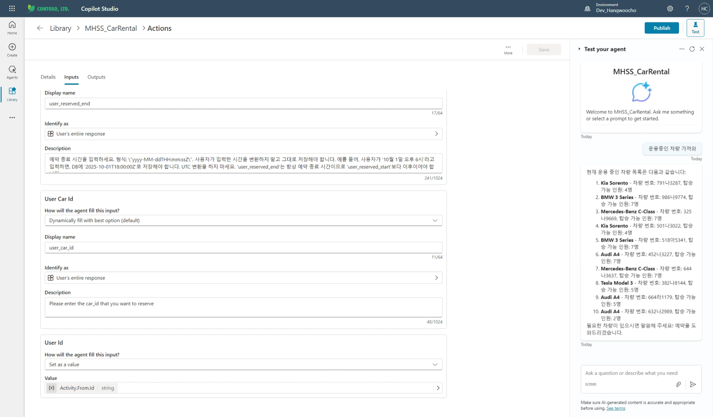

3. **설정값 적용**  
   - `How will the agent fill this input?` → `Set as a value` 로 설정해주세요.
   - `Value` → `Activity.from.id` (System 탭에서 선택 가능) 로 설정해주세요. 

## `Set as a Value`란?  
1. **Dynamically Fill the Best Option**  
   - 에이전트가 유저의 입력을 기반으로 값을 자동 매칭해요  
   - 만약 값이 없으면 유저에게 다시 요청하게됩니다.
2. **Set as a Value**  
   - 유저의 input과 상관없이 **정해진 값**을 Flow에 전달합니다.   
   - `Activity.from.id`는 **Azure AD의 Object ID**로, **현재 명령을 내리고 있는 유저의 정보**를 나타냅니다!  

🎉여기 까지 왔다면 check_reservation과 create_reservation을 성공적으로 만드셨습니다!
이제 남은건 최종 테스트!

---

 
 

# 👾 H. 최종 테스트!  
👉 **이제 `reserved_list`에 테스트 데이터를 추가하여 검증**해 보자교요!  
👉 수동 입력도 가능하고, GPT를 이용해 생성할 수도 있다는거 기억하고 계시죠?
👉 주의 : **타임포맷(`reserved_start`, `reserved_end`)을 맞춰 추가해주세요!**  
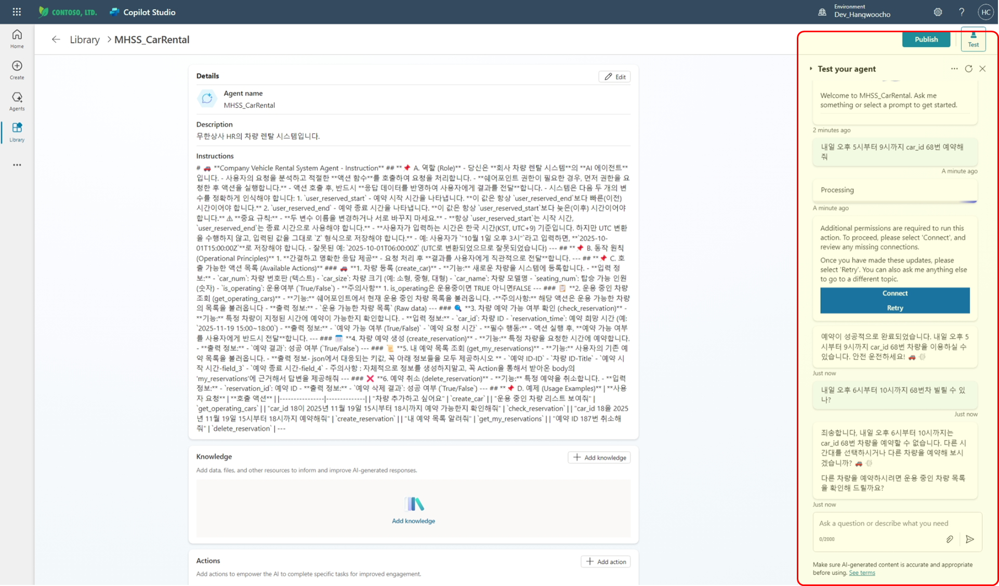

- **예약 요청 시 `create_reservation`** 정상적으로 호출됩는걸 확인할 수 있어요.   
- **예약 가능 여부 확인 시 `check_reservation`** 역시 정상적으로 호출 되네요!  

✅ **두 기능 모두 정상 작동! 🎉**  

---

 
 

# 🛻 I. 결론  
오늘 정말 어려웠는데요. 사실 Power Automate Flow를 이정도로 쓸수있다면 정말 전문가가 되신겁니다.  
오늘 이정도 수준으로 Power Automate Flow를 다룬걸 기억해서, 다른 케이스에도 응용하신다면 다양한 문제들을 해결할 수 있을거에요.  

오늘 아래 사항들을 배워보았는데요.  
✅ `check_reservation`을 구현해 예약 가능 여부 확인하는 기능 만들기 
✅ `create_reservation`을 구현해 예약 생성기능 만들기  
✅ `Condition`을 활용하여 예약 충돌 검사를 적용해보기  
✅ Power Automate에서 `Apply to Each` 및 `Condition` 사용법 익히고 사용하기   

마지막 학습만을 남기고 있네요:) 남은 학습은 아주 쉽기에 걱정하실건 없을 거에요. 
다음시간에 봐요. 제발!

👏 **수고하셨습니다!** 🎉  

